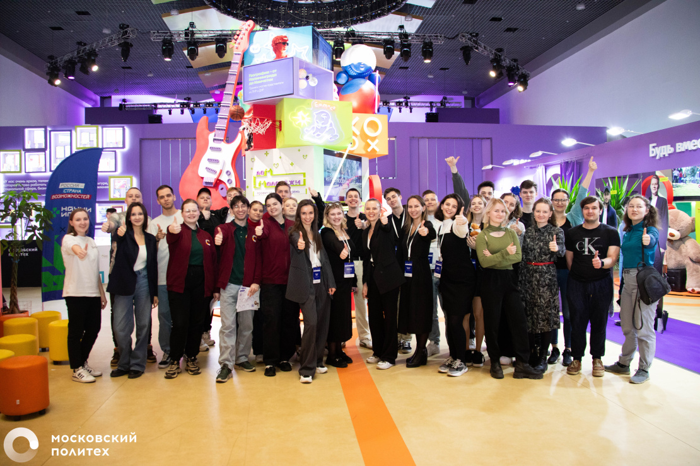

###  Участие в Карьерном марафоне в Московском Политехе
**Место проведения:** Московский Политехнический Университет  

Мероприятием в рамках проектной практики стал **Карьерный марафон**, прошедший на территории Московского Политеха.  

В этот день в университете собрались HR-представители множества компаний. На своих стендах они делились информацией:
- о действующих программах стажировок и возможностях трудоустройства;
- о требованиях к кандидатам и этапах отбора;
- о корпоративной культуре и ценностях организаций.

Представители активно приглашали студентов на собеседования, а также раздавали фирменные сувениры и мерч.  

Участие в этом событии позволило мне чётче понять, какие компетенции и навыки востребованы для начала карьеры в IT и области кибербезопасности.

